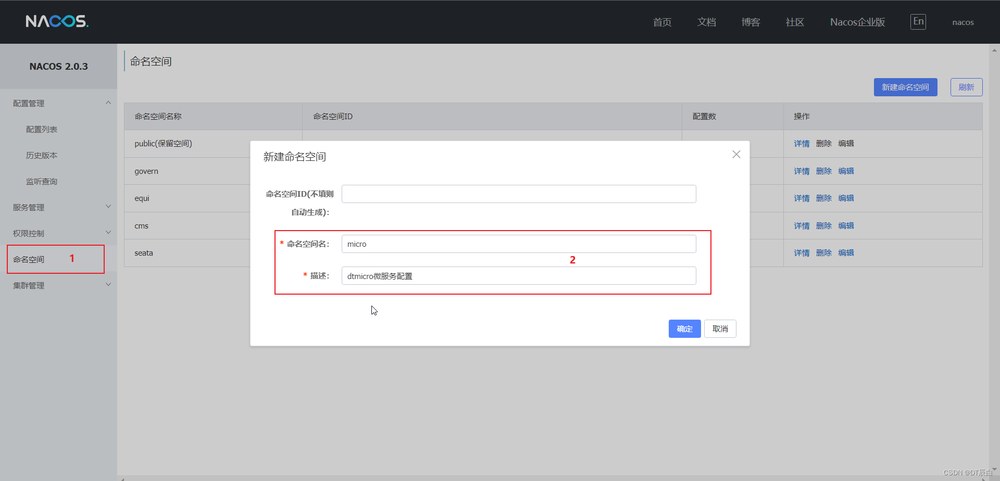
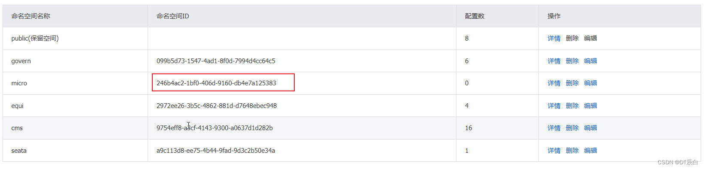
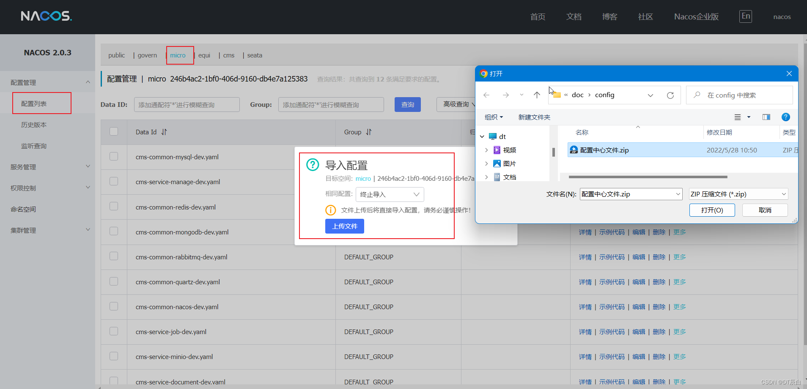
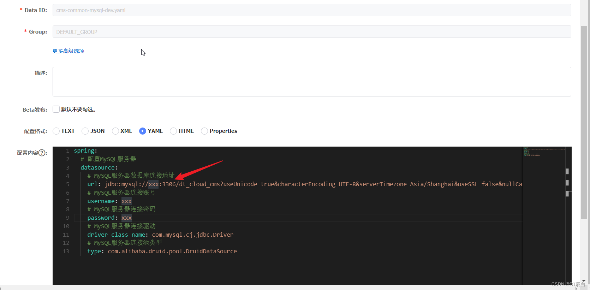
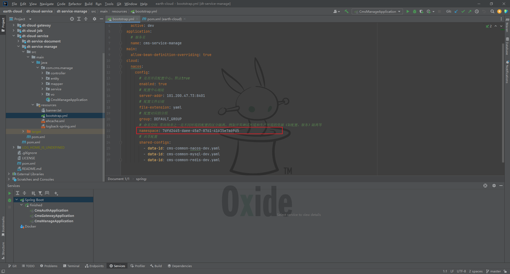
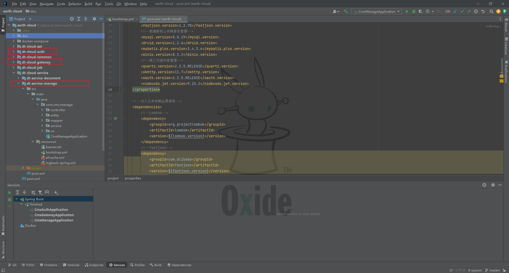

                                 
### DT MICRO 平台

 **Spring Cloud Alibaba全套分布式微服务，前后端分离架构，大道至简、代码玄学、开箱即用**   

 

 

  
 

# 平台简介

 **DT MICRO**  是一套SpringCloud微服务架构设计的后台管理系统，追求 **快速的用户体验** 、 **二次编码** ，以及 **核心技术模块的整合** 使用。后端新技术框架的加持、前端UI的设计与美化，会持续升级，持续完善，欢迎亲友们收藏、点赞和转发。

## 核心技术

框架组成SpringCloud、Nacos、GateWay、Sentinel、Seata、Oauth2.0，消息队列采用RabbitMQ，数据库采用MySQL、Redis，mongodb，文件服务器：Minio，前端UI：Vue3、ElementUI

## 部署管理
#### 1、新建命名空间
下载安装好Nacos之后，登录Nacos控制台，新建命名空间【micro】，生成命名空间ID。

注意：生成命名空间ID

#### 2、导入Nacos配置文件
在本项目的根目录doc/config目录下，选择nacos_config_export_20230329154502.zip导入到上一步新建的目标空间【micro】中

#### 3、修改MySQL以及Redis
修改自己本地的MySQL以及Redis的连接配置信息

注意：将源码根目录doc/sql目录下的sql文件【dt_micro.sql】导入到自己的MySQL库中
#### 4、修改源码bootstrap.yml配置文件
将第一步中生成的命名空间ID，填写至每个服务的配置文件中，并且记得修改Nacos地址，比如我的是本地安装的，端口使用的也是默认的，根据自己安装的需求修改即可。

#### 5、启动后端服务
依次启动如下三个微服务即可：

